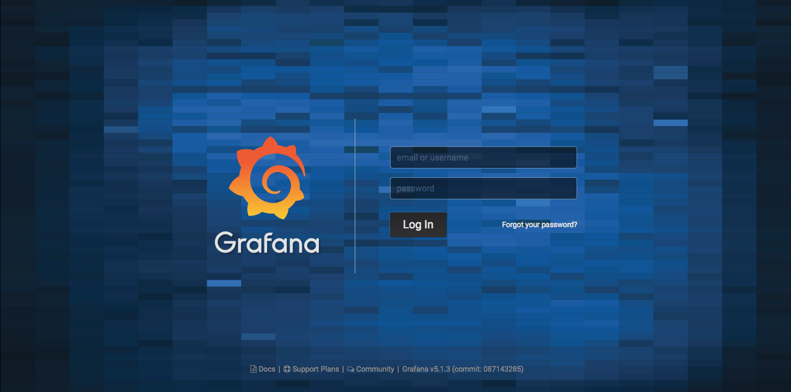
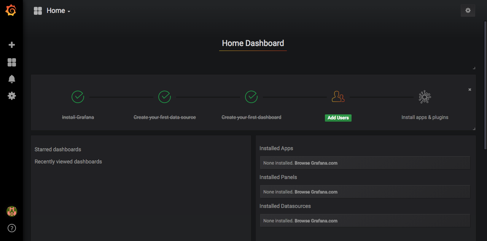
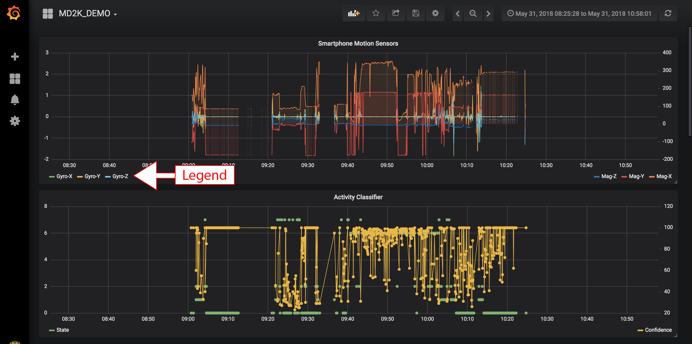
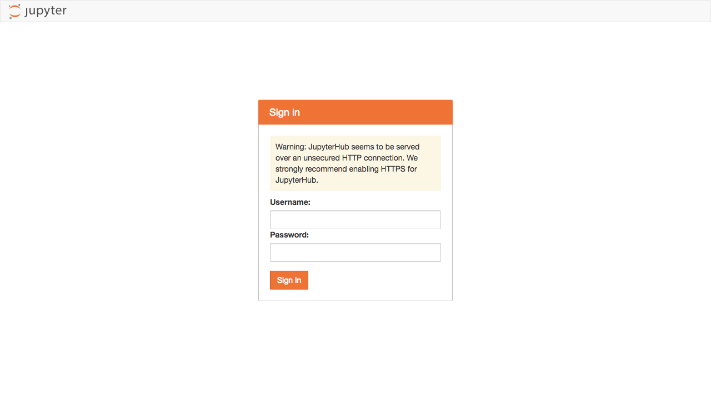
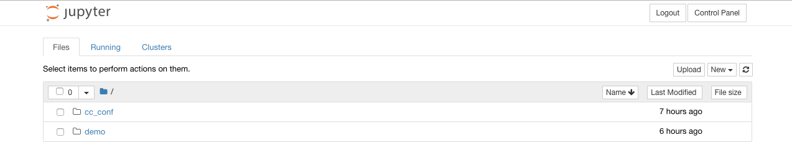
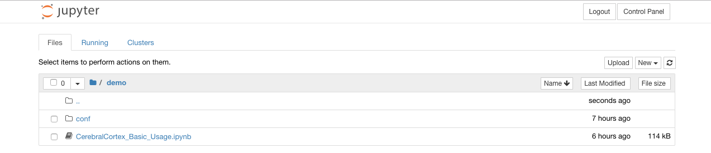
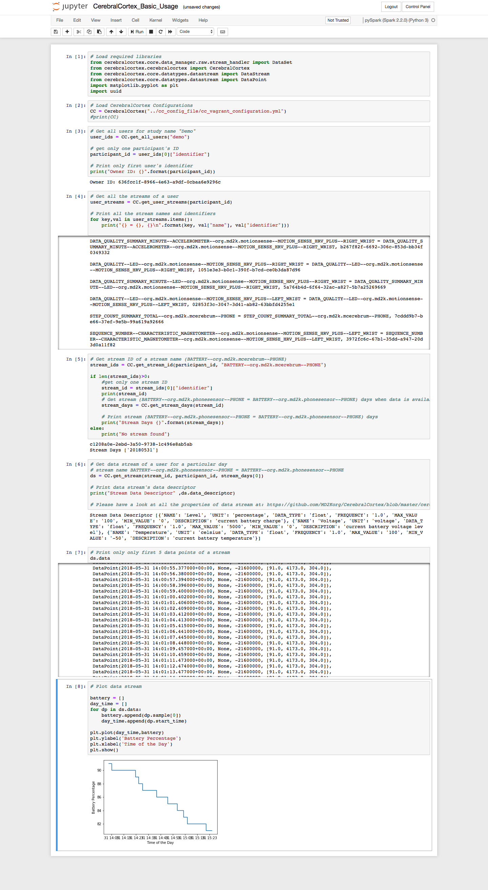

# Cerebral Cortex Cloud Platform
Cerebral Cortex is the big data cloud companion of mCerebrum designed to support population-scale data analysis, visualization, model development, and intervention design for mobile sensor data.

CerebralCortex core provides an interface to retrieve/store mobile sensor raw data and metadata.

You can find more information about MD2K software on our [software website](https://md2k.org/software) or the MD2K organization on our [MD2K website](https://md2k.org/).

This repository is allows you to install and evaluate the Cerebral Cortex platform.

### Python Source Code Repos
* [CerebralCortex-APIServer](https://github.com/MD2Korg/CerebralCortex-APIServer)
* [CerebralCortex-Kernel](https://github.com/MD2Korg/CerebralCortex-Kernel)


### Note
We have renamed following repositories.
* CerebralCortex-Platform -> CerebralCortex
* CerebralCortex - >  CerebralCortex-Kernel

### Releases
* **2018.03.18** Cerebral Cortex Cloud Platform
  - Grafana visualization support
  - Jupyter Notebook analysis platform
  - [Cerebral Cortex 3.0.0](https://github.com/MD2Korg/CerebralCortex-Kernel/releases)
  - File system based storage architecture
  - Ability to collect data from [mCerebrum](https://md2k.org/mc2015) app (**Note:** mCerebrum is not compatiable for CerebralCortex 3.0.0 yet.)

# Disclaimer
This software is intended for informational and demonstration purposes only and is not designed to diagnose, treat, cure, prevent, or track disease or health states. No content provided in this software is intended to serve as a substitute for any kind of professional (e.g., medical) advice.

# Installation Instructions
The Cerebral Cortex platform can installed and tested on any of the three major platforms: Linux, Mac OS X, and Windows.  The following instructions will walk you through installing the dependencies necessary to run Cerebral Cortex.  The Docker images take approximately 8 minutes to download, build, and install on a 1000 Mbit/second internet connection. We are continually working on improving the speed with which everything downloads and installs.

## Linux: (Ubuntu 18.04)
These steps are performed from the command line and do not need a graphical interface.

1. [Install Docker](https://docs.docker.com/install/linux/docker-ce/ubuntu/)
  ```bash
  sudo apt-get update

  sudo apt-get install \
    apt-transport-https \
    ca-certificates \
    curl \
    software-properties-common

  curl -fsSL https://download.docker.com/linux/ubuntu/gpg | sudo apt-key add -

  sudo add-apt-repository \
    "deb [arch=amd64] https://download.docker.com/linux/ubuntu \
    $(lsb_release -cs) \
    stable"

  sudo apt-get update
  sudo apt-get install docker-ce
  ```

2. [Install docker-compose](https://docs.docker.com/compose/install)

  ```bash
  sudo curl -L "https://github.com/docker/compose/releases/download/1.23.1/docker-compose-$(uname -s)-$(uname -m)" -o /usr/local/bin/docker-compose

  sudo chmod +x /usr/local/bin/docker-compose
  ```
  Please consult the [Docker](https://docker.com) site if you face any installation errors for step 1 and 2.

3. Download or clone this CerebralCortex-Platform repository.
  ```bash
  git clone https://github.com/MD2KOrg/CerebralCortex-Platform
  cd CerebralCortex-Platform
  docker-compose up
  ```
  In case you encounter an error relating to permissions, add your user to the docker group.
 `sudo usermod -aG docker $USER`

## Mac OS X:

1. [Install Docker](https://docs.docker.com/docker-for-mac/install/)

2. [Install docker-compose](https://docs.docker.com/compose/install)

  ```bash
  sudo curl -L "https://github.com/docker/compose/releases/download/1.23.1/docker-compose-$(uname -s)-$(uname -m)" -o /usr/local/bin/docker-compose

  sudo chmod +x /usr/local/bin/docker-compose
  ```
  Please consult the [Docker](https://docker.com) site if you face any installation errors for step 1 and 2.


3. Download or clone this CerebralCortex-Platform repository.
  ```bash
  git clone https://github.com/MD2KOrg/CerebralCortex-Platform
  cd CerebralCortex-Platform
  docker-compose up
  ```

## Windows 10:

1. [Install Docker](https://docs.docker.com/docker-for-windows/install/)

2. Download the CerebralCortex-Platform repository.  
    Download location: [https://github.com/MD2Korg/CerebralCortex-Platform/archive/master.zip](https://github.com/MD2Korg/CerebralCortex-Platform/archive/master.zip)

3. Extract the `CerebralCortex-Platform-master.zip` file and open it in `Explorer`

4. Open `PowerShell` and run the following commands
  ```PowerShell
  PS C:\Users\hnat> cd Downloads\CerebralCortex-Platform-master
  PS C:\Users\hnat\Downloads\CerebralCortex-Platform-master>

  PS C:\Users\hnat\Downloads\CerebralCortex-Platform-master> docker-compose up
  ```

  Note: Approve the Docker's requests for accessing a shared drive


## Launch Cerebral Cortex
Open the following link to view the Cerebral Cortex launch page: http://localhost/


# WARNING
This version Cerebral Cortex is not configured with SSL/TLS support out of the box and should NOT be utilized to collect human subject data for research.  It is currently designed for development, testing, and training purposes. We are working on a secure-by-default configuration for Cerebral Cortex to avoid this problem in the future.  If you would like to secure this system as is, you will need to configure NGINX's SSL/TLS support manually.


## Optional: Steps to Explore Underlying Services

Use the commands below to confirm that everything is installed and working correctly. Docker-Compose commands can be used to interact with Cerebral Cortex's containers. The following commands lists the the status of all the services used by CerebralCortex.  Most containers for Cerebral Cortex will report a (healthy) state as long as they are running.

```bash
docker-compose ps
```

The above commands display the status of all the services as such as the example shown below.
```
          Name                         Command                       State                                 Ports                       
---------------------------------------------------------------------------------------------------------------------------------------
cerebralcortex-apiserver    /entrypoint.sh /start.sh         Up (health: starting)   443/tcp, 80/tcp                                   
cerebralcortex-grafana      /run.sh                          Up                      0.0.0.0:3000->3000/tcp                            
cerebralcortex-influxdb     /entrypoint.sh influxd           Up                      0.0.0.0:8086->8086/tcp                            
cerebralcortex-jupyterhub   sh -c chown -R md2k /cc_da ...   Up (health: starting)   0.0.0.0:32777->8000/tcp                           
cerebralcortex-kafka        start-kafka.sh                   Up                      0.0.0.0:9092->9092/tcp                            
cerebralcortex-mysql        docker-entrypoint.sh mysqld      Up                      0.0.0.0:3306->3306/tcp, 33060/tcp                 
cerebralcortex-nginx        nginx -g daemon off;             Up (health: starting)   0.0.0.0:443->443/tcp, 0.0.0.0:80->80/tcp          
cerebralcortex-zookeeper    /bin/sh -c /usr/sbin/sshd  ...   Up                      0.0.0.0:2181->2181/tcp, 22/tcp, 2888/tcp, 3888/tcp
```


#### Import and analyze the data
Data is **automatically** imported into the system when mCerebrum is connected to the cloud platform.  You can also initiate a replay of the data in the following way.

  <!-- ```bash
  ???docker-compose run dataingestion sh batch_import.sh
  ```
**Note: Exceptions and Warnings are to be expected during the data ingestion and analyzing phase**

A large number of console logs will appear on the screen indicating what the system is currently doing.  It will first preprocess the data files you copied from the mCerebrum app into a format that Cerebral Cortex will ingest.  Next, the ingestion pipeline will scan and import this data into Cerebral Cortex's internal data stores. -->

# Connecting mCerebrum
mCerebrum is our mobile application for Android that collects, processes, and transmits data to Cerebral Cortex.  It is available here: https://md2k.org/mc2015 for download and installation.  This app will let you authenticate with the default user and password `md2k:md2k` and your DNS entry for the Cerebral Cortex server.  From this point, it will automatically download the configuration file one the system and start the setup process.  The phone will upload data every 15 minutes data sources that are not raw sensor data and every hour for high-rate raw sensors.  These will be reflected in the data processing and visualization interfaces

**Current limitations:**
- The provide mCerebrum configuration `mC_Demo.zip` in the `minio/configuration` folder need to be modified to support the proper data upload URL.  Once you extract this zip file, edit the `mCerebrum/org.md2k.datakit/config.json` file and change the `upload:url` to your DNS entry for Cerebral Cortex.  Recompress the mCerebrum folder and overwrite the current zip file.
- If mCerebrum does not properly connect to your provided DNS host running Cerebral Cortex, you MUST **force stop** the app on the phone before relaunching and logging into Cerebral Cortex.  

Both of these bugs are logged in the tracking system and we will fix them when we can but this should not prevent you from testing out the platform.


# Visualizing and Analyzing Your Data
Cerebral Cortex provides two mechanisms to visualize and analyze your data.  First, a user-centric interface is provided by the [Grafana](https://grafana.com/) project which can be utilized to plot and explore Cerebral Cortex data streams.  Second, a code-centric interface is provided by the [Jupyter](http://jupyter.org/) project and allows a user to write Python 3 code to interact with the Cerebral Cortex kernel.

## Visualization of data with Grafana
Open this link in your web browser http://localhost/grafana/login to visualize your data.  

1. The default login and password are both `admin`.  

  


2. Once you authenticate, you will see the following screen.

  


3. Select the `Home` dropdown at the top-left of the screen and choose the **MD2K** dashboard.

  


This is a pre-built visualization that provides some examples of the various types of displays that are possible.  

For example:
- Smartphone Accelerometer/Gyrometers/Magentometer
- Battery levels of connected devices
- Step count as determined from the smartphone
<!-- - Data Yield of MSHRV-LED, MSHRV-Accel, AutoSenseBLE -->
<!-- - Geolocation -->
<!-- - Phone/SMS/Notifications -->
<!-- - Phone screen touches -->

You may [create additional dashboards](http://docs.grafana.org/guides/getting_started/) to visualize all of the raw and processed data.


## Analyzing your data with Jupyter Notebooks
Open this link in your web browser http://localhost/jupyterhub/hub/login to interact and analyze your data.  

1. A login screen will be shown as follows.  

  The username and password are both `md2k`.  The warning shown is because this site is running locally on your machine and is not secured by a security certificate.  There is no data leaving the machine and going across the internet.

  


2. A file browser will appear after successful authentication and you should choose the `cc_demo` folder.

  

  


3. Click on the `CerebralCortex_Basic_Usage.ipynb` and it will open in a new tab.  This provides an overview of how to utilize Cerebral Cortex and visualize some data.

  


This example notebook demonstrates the following:
  - Import CerebralCortex libraries and loading configurations
  - Get all users of a study
  - Get all streams of a user
  - Get days when a stream has data available
  - Get a stream's raw data and metadata
  - Plot stream raw data


### Creating your own scripts

  1. Authenticate with user credentials
  2. Click on Files tab
  3. Click on new and select `pySpark (Spark 2.3.2) (Python 3)` to create a new Python script.


## Computing features
The [CerebralCortex-DataAnalysis](https://github.com/MD2Korg/CerebralCortex-DataAnalysis) repository is available as a Docker container (cerebralcortex-dataanalysis).  This repository contains the code to compute features on the data. These features are located in the `core/feature` directory.

The following features have been validated by our team and are considered stable with the remaining features still
under development. Please have a look at the documentation for each of the above features to get more insight into their functionality. Sensors/features in parentheses should be considered dependencies to compute the specified feature.

#### Stable Features
  * phone_features (Smartphone)
  * phone_screen_touch_features (Smartphone)
  * puffMarker (MotionSenseHRV)

#### Features Under Development
  * activity and posture classification (MotionSenseHRV)
  * typing features (MotionSenseHRV)
  * rr_interval (MotionSenseHRV)

### Running Data Analysis
The container can be run against any temporal subset of data within the system after you have collected and/or ingested data.  From the CerebralCortex-Platform folder run the following command.  The console will output a log of the individual modules debug messages.  Additionally, this container will launch at the initial docker-compose startup and process any data already in the system.

```bash
Format: docker-compose run dataanalysis sh compute_features.sh StartDate(YYYYMMDD) EndDate(YYYYMMDD)

docker-compose run dataanalysis sh compute_features.sh 20181101 20190101
```

### Running Data Analysis in the Jupyter notebook
The Jupyter notebook also has the DataAnalysis code in the DataAnalysis folder.
In this folder there is a sample notebook `Simple_driver.ipynb` that can be used
to execute features described above. In this sample, the phone based features are
computed. Change the input parameters in the notebook to compute the desired features.


## Starting and stopping Cerebral Cortex
Stop Cerebral Cortex
```bash
docker-compose down
```

Start Cerebral Cortex
```bash
docker-compose up
```

Delete all data and container data for Cerebral Cortex
```bash
docker-compose stop
docker-compose rm

make clean
```


## FAQ

1. **I'm stuck, where do I get help?**

  Please look for more information or ask for help here: https://mhealth.md2k.org/discuss/

2. **How do I find out about new releases and software announcements**

    Please sign up for our software announcement mailing list: md2k-software@googlegroups.com

3. **System requirements**

  These are the minimum recommended system requirements for running Cerebral Cortex.
  - 2-4 core CPU
  - 16+ GB RAM
  - 10GB disk + enough to support the total data collection from mCerebrum
   

## Contributing
Please read our [Contributing Guidelines](https://md2k.org/contributing/contributing-guidelines.html) for details on the process for submitting pull requests to us.

We use the [Python PEP 8 Style Guide](https://www.python.org/dev/peps/pep-0008/).

Our [Code of Conduct](https://md2k.org/contributing/code-of-conduct.html) is the [Contributor Covenant](https://www.contributor-covenant.org/).

Bug reports can be submitted through [JIRA](https://md2korg.atlassian.net/secure/Dashboard.jspa).

Our discussion forum can be found [here](https://discuss.md2k.org/).

## Versioning

We use [Semantic Versioning](https://semver.org/) for versioning the software which is based on the following guidelines.

MAJOR.MINOR.PATCH (example: 3.0.12)

  1. MAJOR version when incompatible API changes are made,
  2. MINOR version when functionality is added in a backwards-compatible manner, and
  3. PATCH version when backwards-compatible bug fixes are introduced.

For the versions available, see [this repository's tags](https://github.com/MD2Korg/CerebralCortex/tags).

## Contributors

Link to the [list of contributors](https://github.com/MD2Korg/CerebralCortex/graphs/contributors) who participated in this project.

## License

This project is licensed under the BSD 2-Clause - see the [license](https://md2k.org/software-under-the-hood/software-uth-license) file for details.

## Acknowledgments

* [National Institutes of Health](https://www.nih.gov/) - [Big Data to Knowledge Initiative](https://datascience.nih.gov/bd2k)
  * Grants: R01MD010362, 1UG1DA04030901, 1U54EB020404, 1R01CA190329, 1R01DE02524, R00MD010468, 3UH2DA041713, 10555SC
* [National Science Foundation](https://www.nsf.gov/)
  * Grants: 1640813, 1722646
* [Intelligence Advanced Research Projects Activity](https://www.iarpa.gov/)
  * Contract: 2017-17042800006
